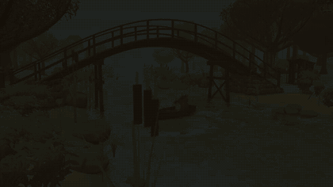
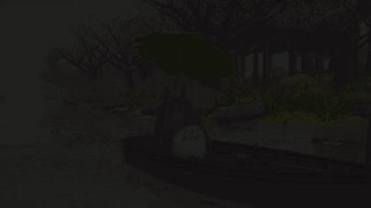
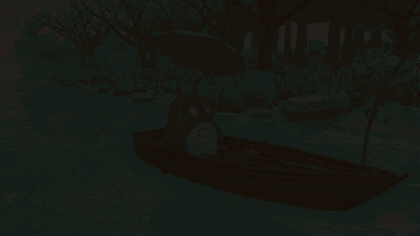
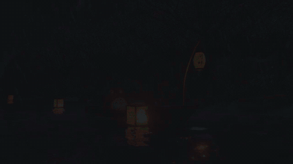
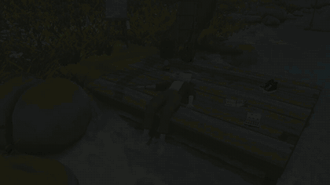

# ghibli-threejs

> ## 🌿 A note from the author
>
> **While building my Ghibli river 3D project, I spent days iterating on it, one improvement
> after another. The skills below are what I extracted from that work.**
>
> **If you like the visuals, effects and interactive features of
> [riverbook.tanhoochuan.my](https://riverbook.tanhoochuan.my/), grab this repo and try them
> yourself.**

## Showcase

Clips from the scene these skills came from. Click a preview to open the 720p video.

| | |
|---|---|
| [](media/boat-circle.mp4)<br>**Boat on the river**: water, buoyancy, wake | [](media/boat-day-night.mp4)<br>**Day into night**: day cycle, night mode |
| [](media/boat-underwater.mp4)<br>**Below the surface**: underwater effect, koi | [](media/night-lantern.mp4)<br>**Lanterns at night**: lanterns, fireflies, moonlit water |
| [](media/book-read.mp4)<br>**The self-writing book**: object interaction | |

Agent skills for building a hand-painted, **Ghibli-style 3D world in three.js / WebGL**:
realistic river water, toon-shaded foliage, painterly skies, a moonlit night, weather,
swimming creatures, cinematic interaction, guided camera tours, and the headless-Blender →
GLB asset pipeline behind them.

Every skill was mined from one real project, a ~6,000-line single-file three.js scene
(r186, WebGLRenderer + EffectComposer) built iteratively with Claude Code. Each one keeps
the **numbers that worked** and the **pitfalls that each cost a full iteration**, so you
don't have to rediscover them.

The skills follow the [Agent Skills](https://agentskills.io/) format
(`skills/<name>/SKILL.md` + optional `references/` code excerpts). Claude Code, Codex,
Cursor, GitHub Copilot, Gemini CLI, OpenCode, and other agents that support this format
can use them. Each agent discovers skills from its own install directories; the
`skills/` directory in this repo is the source to install from.

## Install

Run install commands from the **project where you want to use the skills**, unless you
choose a global install. You only need the skills relevant to your scene.

### Choose skills and agents with `npx` (optional)

If you have Node.js, the [skills CLI](https://github.com/vercel-labs/skills) can find
this repo's skills and install them for the agents you select:

```bash
npx skills add nicksonthc/ghibli-threejs --list  # preview available skills
npx skills add nicksonthc/ghibli-threejs         # choose skills and agents interactively
```

Add `-g` to the second command to install for your user across projects. `npx` is a
convenience, not a requirement; the manual options below work without Node.js.

### Claude Code plugin (all skills)

Inside Claude Code, run:

```text
/plugin marketplace add nicksonthc/ghibli-threejs
/plugin install ghibli-threejs@ghibli-threejs
```

These `/plugin` commands are specific to Claude Code. The other agents use the
Agent Skills folders below.

### Copy skills manually

From your target project, clone the source outside the project and copy an **entire
skill folder** (including `references/`) into your agent's skills directory:

```bash
git clone https://github.com/nicksonthc/ghibli-threejs /tmp/ghibli-threejs-skills
mkdir -p .agents/skills
cp -R /tmp/ghibli-threejs-skills/skills/threejs-webgl-realistic-water .agents/skills/
```

For a personal install, use `~/.agents/skills/` instead of `.agents/skills/`.
The shared `.agents/skills/` path is recognized by most agents below; Claude Code
uses `.claude/skills/` instead.

| Agent / IDE | Project skills directory | Personal skills directory |
|---|---|---|
| [Claude Code](https://code.claude.com/docs/en/skills) | `.claude/skills/` | `~/.claude/skills/` |
| [Codex](https://developers.openai.com/codex/skills/) | `.agents/skills/` | `~/.agents/skills/` |
| [Cursor](https://cursor.com/docs/skills) | `.agents/skills/` or `.cursor/skills/` | `~/.agents/skills/` or `~/.cursor/skills/` |
| [GitHub Copilot in VS Code](https://code.visualstudio.com/docs/agent-customization/agent-skills) | `.agents/skills/` or `.github/skills/` | `~/.agents/skills/` or `~/.copilot/skills/` |
| [Gemini CLI](https://geminicli.com/docs/cli/creating-skills/) | `.agents/skills/` or `.gemini/skills/` | `~/.agents/skills/` or `~/.gemini/skills/` |
| [OpenCode](https://opencode.ai/docs/skills) | `.agents/skills/` or `.opencode/skills/` | `~/.agents/skills/` or `~/.config/opencode/skills/` |
| [Cascade / Windsurf](https://docs.windsurf.com/windsurf/cascade/skills) | `.agents/skills/` or `.devin/skills/` (`.windsurf/skills/` legacy) | `~/.agents/skills/` or `~/.codeium/windsurf/skills/` |

Other agents may support `SKILL.md` but use different paths; check their docs or use
the skills CLI's agent selector. After installation, start a new agent session if the
skill is not discovered. Then ask for an effect ("add realistic water with refraction
to my river") or use a skill's **paste-ready prompt** with its `{{slots}}` filled in.

## Skills

### Water
| Skill | What it gives you | 中文说明 |
|---|---|---|
| [threejs-webgl-realistic-water](skills/threejs-webgl-realistic-water) | Depth-aware refraction, Beer–Lambert absorption, planar reflection, shadowed sun glints, mipmapped ripple normals, caustics, pebble riverbed | 基于深度的折射、比尔–朗伯吸收、平面反射、带阴影的阳光高光、Mipmap 涟漪法线、焦散、卵石河床 |
| [threejs-webgl-underwater-effect](skills/threejs-webgl-underwater-effect) | Diving below the surface: Snell's window, total internal reflection, light shafts, bubbles, underwater grade, and an over-under lens (half above / half below the waterline) | 潜入水面之下：斯涅尔窗、全内反射、光柱、气泡、水下调色，以及水线分屏镜头（半水上半水下） |
| [threejs-boat-buoyancy-steering](skills/threejs-boat-buoyancy-steering) | Gerstner waves shared by GPU and CPU, buoyant boat, smooth drifting lane, click-to-steer with autopilot, chase camera | GPU 与 CPU 共用的 Gerstner 波、浮力小船、平滑漂流航线、点击掌舵与自动驾驶、追随相机 |
| [threejs-webgl-wake-simulation](skills/threejs-webgl-wake-simulation) | Kelvin wake — analytic, then a GPU iWave height-field simulation with foam and bow wave | 开尔文尾迹：先用解析模型，再用 GPU iWave 高度场模拟，含泡沫与船首波 |
| [threejs-webgl-waterfall-effect](skills/threejs-webgl-waterfall-effect) | Waterfall off a real cliff lip into a carved plunge basin: layered sheets, spray, rainbow, mist | 从真实崖口倾泻入冲刷潭的瀑布：分层水幕、水雾、彩虹、薄雾 |

### Look: sky, foliage, materials, post
| Skill | What it gives you | 中文说明 |
|---|---|---|
| [threejs-ghibli-sky-clouds](skills/threejs-ghibli-sky-clouds) | Painterly sky dome, horizon haze, soft sun halo, instanced hand-painted cumulus | 手绘风天空穹顶、地平线雾霭、柔和日晕、实例化手绘积云 |
| [threejs-ghibli-toon-shading](skills/threejs-ghibli-toon-shading) | Banded toon light without banded shadows, warm shadow fill, puff normals, backlit SSS, wind with synced shadows | 分段卡通光照但阴影不分段、暖色阴影补光、蓬松法线、逆光次表面散射、与阴影同步的风动 |
| [threejs-procedural-vegetation](skills/threejs-procedural-vegetation) | Crafted trees, bamboo, shrubs, meadow grass, wildflowers, reeds, lilies, sakura petals, rice paddies — instanced | 精制树木、竹林、灌木、草甸、野花、芦苇、睡莲、樱花花瓣、稻田——全部实例化 |
| [threejs-stylized-rock-material](skills/threejs-stylized-rock-material) | River-worn granite: soft facets, moss in vertex alpha, live wet line, grain and bump | 河流冲刷的花岗岩：柔和切面、顶点 Alpha 青苔、实时湿水线、颗粒与凹凸 |
| [threejs-postprocessing-anime-grade](skills/threejs-postprocessing-anime-grade) | GTAO → bloom → grade → OutputPass → SMAA chain and the anime colour grade | GTAO → 泛光 → 调色 → OutputPass → SMAA 后期链与动画风调色 |

### Time, weather, night
| Skill | What it gives you | 中文说明 |
|---|---|---|
| [threejs-day-cycle-lighting](skills/threejs-day-cycle-lighting) | Sunrise-to-sunset sun sweep driving every sun-aware shader; a sun that follows the lens | 日出到日落的太阳轨迹，驱动所有感知太阳的着色器；太阳跟随镜头 |
| [threejs-ghibli-night-mode](skills/threejs-ghibli-night-mode) | Cross-faded night: painted moon, stars, Milky Way, shooting stars, moonlit water, cool grade | 渐变过渡的夜景：手绘月亮、星空、银河、流星、月光水面、冷色调色 |
| [threejs-night-lights-lanterns](skills/threejs-night-lights-lanterns) | Floating paper lanterns with text, fireflies, oil lamps, swinging boat lantern, cheap point lights | 写有文字的漂流纸灯笼、萤火虫、油灯、船头摇曳的灯笼、低成本点光源 |
| [threejs-webgl-rain-effect](skills/threejs-webgl-rain-effect) | Clear / rain / thunderstorm from one wetness value: GPU rain, rings, lightning, thunder, wet materials | 由单一湿度值驱动的晴天 / 雨天 / 雷暴：GPU 雨丝、水面雨圈、闪电、雷声、湿润材质 |

### Creatures & characters
| Skill | What it gives you | 中文说明 |
|---|---|---|
| [threejs-fish-school-boids](skills/threejs-fish-school-boids) | Koi: shader-painted varieties, vertex swimming with matching shadows, calm boids, bioluminescence | 锦鲤：着色器绘制的品种花纹、顶点着色器游动并同步阴影、平稳的群游算法、生物荧光 |
| [threejs-shell-fur-rendering](skills/threejs-shell-fur-rendering) | Instanced shell fur grown on a GLB body, LOD by distance | 在 GLB 模型上生长的实例化壳层毛发，按距离做 LOD |
| [threejs-skeletonless-character-animation](skills/threejs-skeletonless-character-animation) | Blinks, glances, head turns, a leaf in the wind — all in vertex shaders, no skeleton | 眨眼、瞥视、转头、风中的叶子——全部在顶点着色器中完成，无需骨骼 |

### Interaction, camera, UX
| Skill | What it gives you | 中文说明 |
|---|---|---|
| [threejs-object-interaction](skills/threejs-object-interaction) | Hover ring, click-vs-drag, one-shot cinematic, a book that writes itself and flips real pages | 悬停光环、区分点击与拖拽、一镜到底的过场、会自己书写并真实翻页的书 |
| [threejs-camera-guided-tour](skills/threejs-camera-guided-tour) | Hands-free camera journey on a time-parametrised Catmull-Rom path, day into night | 基于时间参数化 Catmull-Rom 路径的自动镜头导览，从白天到黑夜 |
| [threejs-hud-objective-markers](skills/threejs-hud-objective-markers) | Game-style off-screen markers, fly-to arcs, minimal icon-dock HUD | 游戏式屏幕边缘目标标记、弧线飞行跳转、极简图标栏 HUD |
| [threejs-cinematic-loading-screen](skills/threejs-cinematic-loading-screen) | CSS dawn loading gate, captured still that fades into the live scene, shader warm-up | CSS 黎明风加载页、从实时场景截取的静帧淡入实景、着色器预热 |
| [threejs-webaudio-generative-soundtrack](skills/threejs-webaudio-generative-soundtrack) | An original waltz synthesised live with Web Audio, plus river and birdsong ambience | 用 Web Audio 实时合成的原创圆舞曲，配河流与鸟鸣环境音 |

### World & pipeline
| Skill | What it gives you | 中文说明 |
|---|---|---|
| [threejs-open-world-streaming](skills/threejs-open-world-streaming) | A 600 m river world: water SDF, chunked terrain, tree pools, landmarks, distance culling | 600 米河流世界：水域 SDF、分块地形、树木池、地标、距离剔除 |
| [threejs-blender-glb-pipeline](skills/threejs-blender-glb-pipeline) | Reference image → scene: asset contract, headless Blender agents, GLB export gotchas, Draco | 参考图 → 场景：资产规范、无头 Blender 代理、GLB 导出陷阱、Draco 压缩 |
| [threejs-webgl-performance-profiling](skills/threejs-webgl-performance-profiling) | Honest GPU timing, pass budgets, compile hitches, culling, LOD | 准确的 GPU 计时、渲染通道预算、编译卡顿、剔除、LOD |
| [threejs-headless-visual-verification](skills/threejs-headless-visual-verification) | Playwright + GPU capture of WebGL frames, shot lists, and the traps that give stale frames | 用 Playwright + GPU 截取 WebGL 画面、镜头清单，以及导致过期帧的陷阱 |

## Conventions

- Skill names are `threejs-<area>-<feature>` in kebab-case; the folder name equals the
  `name:` in the frontmatter.
- `{{double braces}}` in prompts are slots for your own scene (entry file, character,
  reference image …).
- `references/` holds trimmed code excerpts from the original scene. They show the
  technique; adapt uniform names and scene coupling to your project.

## Credits & disclaimer

"Ghibli-style" describes an aesthetic. This project is not affiliated with or endorsed by
Studio Ghibli, and it ships no Studio Ghibli assets, characters or music — the soundtrack
skill explicitly composes original music.

MIT licensed. Contributions and new pitfalls welcome.
